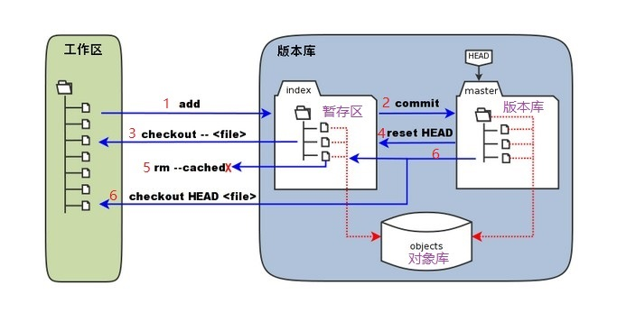

## 基本概念

- **工作区：**就是你在电脑里能看到的目录。

- **暂存区：**".git目录下" 下的index文件

- **版本库：**工作区有一个隐藏目录.git，这个不算工作区，而是Git的版本库。

- **对象库：**位于 ".git/objects" 目录下，里面包含了创建的各种对象及内容。

- **HEAD：** 指向某分支的一个"游标"

- `HEAD`: The current ref that you’re looking at. In most cases it’s probably refs/heads/master 

  当前目录下最近的一次commit
- `FETCH_HEAD`: The SHAs of branch/remote heads that were updated during the last git fetch  从远端或分支fetch过来的标志
- `ORIG_HEAD`: When doing a merge, this is the SHA of the branch you’re merging into. 
做合并时合并后的分支
- `MERGE_HEAD`: When doing a merge, this is the SHA of the branch you’re merging from. 
合并时合并前的分支
- `CHERRY_PICK_HEAD`: When doing a cherry-pick, this is the SHA of the commit which you are cherry-picking.



1.  "git add"时 ，暂存区的目录树被更新，同时工作区修改（或新增）的文件内容被写入到对象库中的一个新的对象中，而该对象的ID被记录在index中。
2. "git commit"时，暂存区的目录树写到版本库（对象库）中，master 分支会做相应的更新。即 master 指向的目录树就是提交时暂存区的目录树。
3.  "git checkout ." 或者 "git checkout --filename" 时，会用暂存区全部或指定的文件覆盖工作区的文件。这个操作很危险，会清除工作区中未添加到暂存区的改动。
4. "git reset HEAD" 时，暂存区的目录树会被重写，被 master 分支指向的目录树所覆盖，但是工作区不受影响。
5.  "git rm --cached filename" 时，会直接从暂存区删除文件，工作区则不做出改变。
6.  "git checkout HEAD ." 或者 "git checkout HEAD filename" 命令时，会用 HEAD 指向的 master 分支中的全部或者部分文件覆盖暂存区和以及工作区中的文件。这个命令也是极具危险性的，因为不但会清除工作区中未提交的改动，也会清除暂存区中未提交的改动。


## 常用命令

```bash
#查看分支
git branch 
git branch -a
#创建分支
git branch branchname
#切换分支
git checkout branchname
#合并分支
git merge 

#从远程仓库下载新分支与数据
git fetch
#从远端仓库提取数据并尝试合并到当前分支：
git merge
#要查看当前配置有哪些远程仓库，可以用命令：
git remote
git remote -v

```


