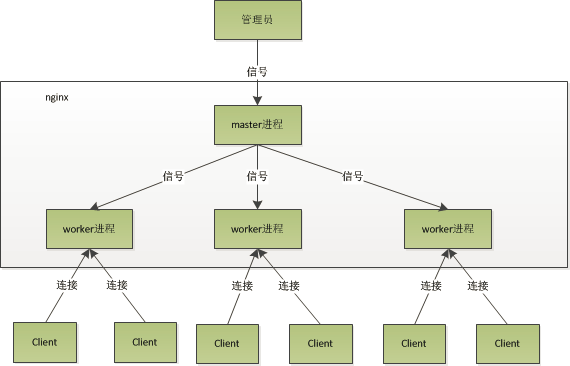

### 安装步骤

> 安装gcc和库文件:
>
> ```
> yum -y install make zlib zlib-devel gcc-c++ libtool  openssl openssl-devel
> ```
>
> 编译安装pcre：
>
> ```bash
> cd /usr/local/
> wget http://downloads.sourceforge.net/project/pcre/pcre/8.35/pcre-8.35.tar.g
> tar zxvf pcre-8.35.tar.gz
> cd pcre-8.35
> ./configure
> make && make install
> ```
>
> 编译安装Nginx
>
> ```bash
> cd /usr/local/
> wget http://nginx.org/download/nginx-1.8.1.tar.gz
> tar zxvf nginx-1.8.1.tar.gz
> cd nginx-1.8.1
> ./configure \
> --prefix=/usr/local/webserver/nginx \
> --with-http_stub_status_module --with-http_ssl_module \
> --with-pcre=/usr/local/src/pcre-8.35
> make && make install
> /usr/local/webserver/nginx/sbin/nginx -v
> ```
>
> 创建 www 用户组
>
> ```bash
> groupadd www
> useradd -g www www
> ```
>
> 修改 nginx.conf
>
> ```properties
> user  www;
> http { 
>     upstream  myserver #配置集群
>     {
>         server  127.0.0.1:18080  weight=1;
>         server  127.0.0.1:28080  weight=2;
>     }
>     server {
>         listen       8888;
>         server_name demo.com  #监听HOST为demo.com的请求
>         location / { 
>             proxy_pass http://myserver;  #myserver
>         }
>     }
> }
> ```

### 管理命令

```bash
./nginx				#启动
./nginx -s reload	#重载配置
./nginx -s reopen	#重启
./nginx -s stop 	#停止
```

### 配置文件-路径匹配？

```bash
~ 	     #为区分大小写匹配
~*	     #为不区分大小写匹配
!~	     #分别为区分大小写不匹配
!~*	     #不区分大小写不匹配
-f       #判断是否存在文件 
-d       #判断是否存在目录
-e       #判断是否存在文件或目录 
-x       #判断文件是否可执行
!-x      #判断文件是否可执行
```

### 配置文件-nginx指令？

nginx.conf  中用到了一些指令，这些指令如下

- root

```properties
location ~ .(mp3|mp4) {
	root /www/media;
}
# /test/123.mp3 -->  /www/media/123.mp3  指定目录作为根目录/www/media/进行检索
```

- alias

```properties
location /test/   
{   
    alias/first/second/img/;
}
# /test/1.jpg  -->  /first/second/img/1.jpg 将字符串/test/替换为/first/second/img/
```

- proxy_pass

```properties
location /test/   
{
    proxy_pass http://127.0.0.1:8080/;   
}
# /test/1.jpg  -->  http://127.0.0.1:8080/1.jpg（转发，不附加/test/路径）
```

```properties
location /test/   
{   
    proxy_pass http://127.0.0.1:8080;
} 
# /test/1.jpg  -->  http://127.0.0.1:8080/test/1.jpg (转发，附加/test/路径)
```

```properties
location/test/   
{   
    proxy_pass http://127.0.0.1:8080/img;
}  
# /test/1.jpg -->  http://127.0.0.1:8080/img1.jpg（未附加/test/路径，但附加了/test/之后的路径
```

## 

### Nginx QA

**Nginx 服务器上的 Master 和 Worker 进程分别是什么?**



nginx在启动后，会有一个master进程和多个worker进程。master进程主要用来管理worker进程，包含：接收来自外界的信号，向各worker进程发送信号，监控worker进程的运行状态，当worker进程退出后(异常情况下)，会自动重新启动新的worker进程。而基本的网络事件，则是放在worker进程中来处理了。多个worker进程之间是对等的，他们同等竞争来自客户端的请求，各进程互相之间是独立的。一个请求，只可能在一个worker进程中处理，一个worker进程，不可能处理其它进程的请求。worker进程的个数是可以设置的，一般我们会设置与机器cpu核数一致


