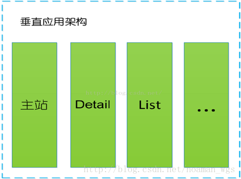
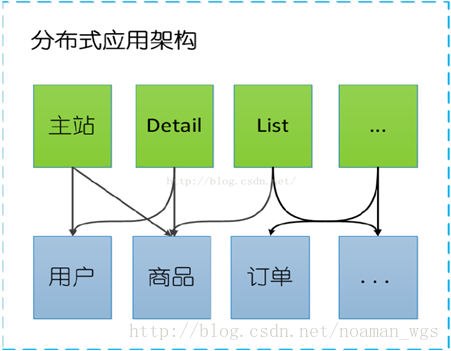

## dubbo 基础篇

1、默认使用的是什么通信框架，还有别的选择吗?

2、服务调用是阻塞的吗？

3、一般使用什么注册中心？还有别的选择吗？

4、默认使用什么序列化框架，你知道的还有哪些？

5、服务提供者能实现失效踢出是什么原理？

6、服务上线怎么不影响旧版本？

7、如何解决服务调用链过长的问题？

8、说说核心的配置有哪些？

9、dubbo推荐用什么协议？

10、同一个服务多个注册的情况下可以直连某一个服务吗？

11、画一画服务注册与发现的流程图

12、集群容错怎么做？

13、在使用过程中都遇到了些什么问题？

14、dubbo和dubbox之间的区别？

## 你还了解别的分布式框架吗？
## 先从电商系统的**演变**讲起

### 单一应用框架(ORM) 

当网站流量很小时，只需一个应用，将所有功能如下单支付等都部署在一起，以减少部署节点和成本。 此时，用于简化增删改查工作量的 数据访问框架(ORM) 是关键。

- 当网站流量很小时，只需一个应用，将所有功能都部署在一起，以减少部署节点和成本。
- ​

### 垂直应用框架(MVC) 

当访问量逐渐增大，而且单一的系统架构随着流量的增加越来越难以维护 ，单一应用增加机器带来的加速度越来越小，将应用拆成互不相干的几个应用，以提升效率。此时，用于加速前端页面开发的 Web框架(MVC) 是关键。

垂直应用架构解决了单一应用架构所面临的扩容问题，流量能够分散到各个子系统当中，且系统的体积可控，一定程度上降低了开发人员之间协同以及维护的成本，提升了开发效率。 

### 分布式应用架构(RPC) 

但是在垂直架构中相同逻辑代码需要不断的复制，不能复用。当垂直应用越来越多，应用之间交互不可避免，将核心业务抽取出来，作为独立的服务，逐渐形成稳定的服务中心，使前端应用能更快速的响应多变的市场需求。此时，用于提高业务复用及整合的 分布式服务框架(RPC) 是关键。

### 流动计算架构(SOA) 

当服务越来越多，容量的评估，小服务资源的浪费等问题逐渐显现，此时需增加一个调度中心基于访问压力实时管理集群容量，提高集群利用率。此时，用于提高机器利用率的 资源调度和治理中心(SOA) 是关键。

随着服务化的进一步发展，服务越来越多，服务之间的调用和依赖关系也越来越复杂，诞生了面向服务的架构体系(SOA)，也因此衍生出了一系列相应的技术，如对服务提供、服务调用、连接处理、通信协议、序列化方式、服务发现、服务路由、日志输出等行为进行封装的服务框架

### 架构演变总结

从以上是电商系统的演变可以看出架构演变的过程： 

### RPC的简介

**RPC(Remote Procedure Call Protocol)：远程过程调用**

两台服务器A、B，分别部署不同的应用a,b。当A服务器想要调用B服务器上应用b提供的函数或方法的时候，由于不在一个内存空间，不能直接调用，需要通过网络来表达调用的语义传达调用的数据。 
说白了，就是你在你的机器上写了一个程序，我这边是无法直接调用的，这个时候就出现了一个远程服务调用的概念。

### Dubbo简介

- 一款分布式服务框架
- 高性能和透明化的RPC远程服务调用方案
- SOA服务治理方案

### Dubbo架构

**Provider**: 暴露服务的服务提供方。 
**Consumer**: 调用远程服务的服务消费方。 
**Registry**: 服务注册与发现的注册中心。 
**Monitor**: 统计服务的调用次数和调用时间的监控中心。

**调用流程** 
0.服务提供者启动，加载，运行。 
1.服务提供者在启动时，向注册中心注册自己提供的服务。 
2.服务消费者在启动时，向注册中心订阅自己所需的服务。 
3.注册中心返回服务提供者地址列表给消费者，如果有变更，注册中心将基于长连接推送变更数据给消费者。 
4.服务消费者，从提供者地址列表中，基于软负载均衡算法，选一台提供者进行调用，如果调用失败，再选另一台调用。 
5.服务消费者和提供者，在内存中累计调用次数和调用时间，定时每分钟发送一次统计数据到监控中心。

### **Dubbo注册中心**

服务提供方和服务消费方来说，他们还有可能兼具这两种角色，即既需要提供服务，有需要消费服务。

**Dubbo提供的注册中心有如下几种类型可供选择**

- Multicast注册中心
- Zookeeper注册中心
- Redis注册中心
- Simple注册中心

### Dubbo优缺点

透明化的远程方法调用 ，像调用本地方法一样调用远程方法；只需简单配置，没有任何API侵入。

软负载均衡及容错机制，可在内网替代nginx lvs等硬件负载均衡器

服务注册中心自动注册 &  配置管理 ，不需要写死服务提供者地址，注册中心基于接口名自动查询提供者ip，使用类似zookeeper等分布式协调服务作为服务注册中心，可以将绝大部分项目配置移入zookeeper集群。

服务接口监控与治理  ，-Dubbo-admin与Dubbo-monitor提供了完善的服务接口管理与监控功能，针对不同应用的不同接口，可以进行 多版本，多协议，多注册中心管理。

### Dubbo入门Demo

主要是以下几个步骤： 

1. 安装Zookeeper,启动； 

2. 创建MAVEN项目，构建Dubbo+Zookeeper+Spring实现的简单Demo； 

   dubbo-api : 存放公共接口； 
   dubbo-consumer :　调用远程服务； 
   dubbo-provider : 提供远程服务。 

3. 安装Dubbo-admin，实现监控。

#### *Zookeeper介绍与安装*

Zookeeper是一个分布式的服务框架，是树型的目录服务的数据存储，能做到集群管理数据 ，这里能很好的作为Dubbo服务的注册中心。

Dubbo能与Zookeeper做到集群部署，当提供者出现断电等异常停机时，Zookeeper注册中心能自动删除提供者信息，当提供者重启时，能自动恢复注册数据，以及订阅请求。

(注：需要先启动zookeeper后，后续dubbo demo代码运行才能使用zookeeper注册中心的功能) 

**下面将详细叙述代码构建过程。** 
1) 首先构建MAVEN项目，导入所需要的jar包依赖。 
需要导入的有spring, dubbo, zookeeper等jar包。 

2)创建dubbo-api的MAVEN项目(有独立的pom.xml，用来打包供提供者消费者使用)。 
在项目中定义服务接口：该接口需单独打包，在服务提供方和消费方共享。 

activeMQ 控制台端口 8161

actveMQ 队列端口 61616

zookeeper 端口 2181

dubbo-admin 端口 8889

dubbo协议端口 20880

rmi  1099 

http  80 

hessian  80  

webservice  80  

memcached  11211  

redis  6379

