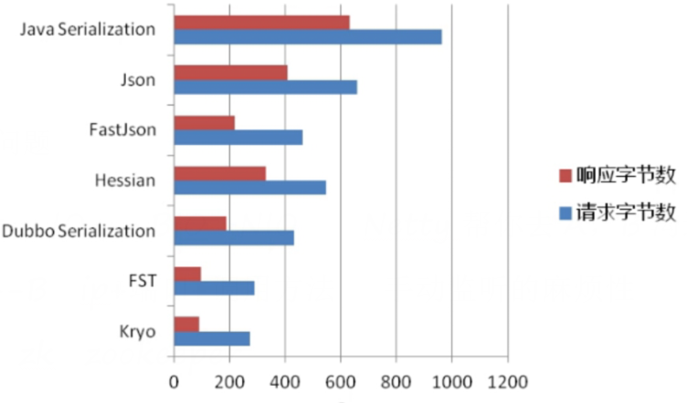

# java基础

## 编译和运行

foreach和while的区别

父类与子类的静态代码构造方法和普通方法的执行顺序？

内部类与外部类？

类的实例化顺序，比如父类静态数据，构造函数，字段，子类静态数据，构造函数，字段，他们的执行顺序

说一说你对环境变量classpath的理解？如果一个类不在classpath下，为什么会抛出ClassNotFoundException异常，  
如果在不改变这个类路径的前期下，怎样才能正确加载这个类？

## 面向对象

抽象类和接口


## 集合框架

**常用集合框架有哪些?**

> 集合框架有两大接口:Collection元素集合 和 Map键值对集合 
> Collection下有 List可重复集合 和Set不可重复集合
> List的实现有:数组结构的ArrayList,Vector和Stack,链表结构的LinkedList
> Set的实现有:HashSet,LinkedHashSet,TreeSet
> Map的实现有:HashMap,LinkedHashMap,TreeMap,Hashtable


**ArrayList 的实现原理**

> ArrayList 是数组实现的.它有一个重要的成员变量 Object[] elementData;
> 插入元素的时候,找到索引所在的位置插入相应的元素,并把当前位置后的元素依次向后移动一位.
> 查询的时候可以直接根据索引获取到对应的元素.
>
> ArrayList 初始容量为10, oldCapacity + (oldCapacity >> 1) 大概1.5倍增长
>
> transient Object[] 是实际存放数据的地方,transient 是为了节省内存做的优化, 
> ArrayList 中自定义了序列化的规则,  
> 只对Object[] 中实际存在的对象进行序列化,而不是整个数组,这样节省了内存.


**Vector的实现原理**

> Vector 与ArrayList 的实现原理一样,都是使用数组来实现的集合,
> 不同的是Vector的增删改查操作都是线程同步的。使用了synchronized关键字
> 保证了线程同步.


**LinkedList 的实现原理**

> LinkedList 是基于双向链表实现的, 它有一个内部类 Node实现了双向的链表的数据结构,Node 中包含了上一个节点和下一个节点的引用
> LinkedList 有三个重要的成员变量:Node first ,Node last ,int size 
>
> 假如size为10,现在需要在索引为3的位置插入一个元素,则从 first 开始,递归向后查找到第四个元素后,
> 在这个Node前面插入新 Node,  
> 然后维护好这两个Node的指针.如果是在索引为8的位置插入 则从last开始,由后向前递归.
> 查询index为3的元素时,从first开始,由第一个节点递归向后查询到第四个元素返回.


**HashMap 的实现原理**

> HashMap 是数组和链表的结合体，本质上是一个数组，数组中保存的是具有链表数据结构的Entry。
> HashMap 的一些私有变量：int capacity；float loadFactor; Entry[] table;int size;int threshold;
>
> put操作的实现：HashMap 的 hash 方法会根据 key 的 hashCode 生成一个索引，如果 table 数组在该位置没有元素，就 new 一个 Entry 保存在该位置，如果已经存在元素且两者的 key 不相等，就将新元素保存在链表头部，如果已经存在元素且两者的 key 相等，就将新元素覆盖旧元素。在JDK8中，当链表长度达到8，会转化成红黑树
>
> 读取的实现：hash 方法会根据 key 的 hashCode 生成一个索引，再取出table数组中的索引处的Entry，然后返回该key对应的value。
>
> HashMap 的扩容：capacity是数组的长度，默认是大小为16，loadFactor 是装载因子，默认0.75，当元素个数，size表示HashMap中存放KV的数量 。threshold 是扩容临界值。当size > threshold 时会进行扩容。扩容会创建一个原来2倍大小的新数组，然后将原哈希表中的所有数据移动到新的哈希表中，相当于对原哈希表中所有的数据重新做了一个put操作。所以性能消耗很大
>
> 链的产生：新的Entry对象添加到 table 中时，新添加的 Entry 对象将持有对原有 Entry 对象的引用，形成Entry链。
>
> Hash 冲突：当试图将两个key的hashCode相同时，会产生hash冲突，hashMap是通过链表的形式解决hash冲突。后添加的 Entry 对象将持有对原有 Entry 对象的引用，形成Entry链。这是哈希算法中解决冲突的一种方法,叫链地址法


**LinkedHashMap 的实现原理**

>LinkedHashMap 是HashMap的子类，拥有HashMap的所有特性。并维护一个自己的双向链表。同时类里有两个成员变量 Entry head ;Entry  tail, 分别指向双向链表的表头、表尾。  accessOrder 默认 false 基于插入顺序 
>
>put 操作: LinkedHashMap并没有重写任何put方法。但是其重写了构建新节点的newNode()方法. 在每次构建新节点时，将新节点链接在内部双向链表的尾部。
>
>get操作：LinkedHashMap的get()方法会改变数据链表，LinkedHashMap具有可预知的迭代顺序：插入顺序、访问顺序。默认是插入顺序排序，如果指定按访问顺序排序，那么调用get方法后会将这次访问的元素放到链表的尾部，不断访问可以形成按访问顺序形成的列表.
>
>LinkedHashMap简直就是为了实现LRU Cache(Least Recently Used)而编写的

```java
Map<String, String> map = new LinkedHashMap<String, String>(16, 0.75f, true);  
for (int i = 0; i < 10; i++) {  
    map.put("key" + i, "value" + i);  
}
map.get("key" + 3);  
for (String value : map.keySet()) {  
    System.out.println(value); // key3:value3 被放在了最后
}
```

**TreeMap 的实现原理**

> TreeMap 初始化的时候会初始化下列参数，第一个Comparator是可以自己定义实现的一个比较的实现，默认为Null,那么默认的比较方式就是compare方法。Entry root;默认为Null。其中Entry内部维护了left,right,parent,color  其中color默认是black。https://www.cnblogs.com/daoluanxiaozi/p/3340382.html

```java
class 节点{
	String str;
	节点 左节点;
	节点 右节点;
	boolean 有左节点(){
		return 左节点!=null;
	}
	boolean 有右节点(){
		return 右节点!=null;
	}
	public 节点(String str) {
		this.str = str;
	}
}
static void 遍历(节点 节点){
	if(节点.有左节点()){
		遍历(节点.左节点);
	}else{
		list.add(节点);
	}
	if(节点.有右节点()){
		遍历(节点.右节点);
	}else{
		return;
	}
}
static ArrayList<节点> list =new ArrayList<节点>();
	public static void main(String[] args) {
		节点 节点1 = new 节点("节点1");
		节点 节点2 = new 节点("节点2");
		节点 节点3 = new 节点("节点3");
		节点 节点4 = new 节点("节点4");
		节点 节点5 = new 节点("节点5");
		节点 节点6 = new 节点("节点6");
		节点 节点7 = new 节点("节点7");
		节点1.左节点=节点2;
		节点2.右节点=节点3;
		节点1.右节点=节点4;
		节点4.左节点=节点5;
		节点4.右节点=节点6;
		节点5.右节点=节点7;
		
		遍历(节点1);
		for (节点  节点 : list) {
			System.out.println(节点.str);
		}
	}
```


**HashSet 的实现原理**

>HashSet 聚合了 一个HashMap ，使用HashMap的key来保存数据， 它所有的方法都是调用HashMap对应的方法来实现的


**Arrays.sort 和 Collections.sort怎么实现的？**

> Arrays.sort对于基本数据类型使用的是快速排序，对 对象使用的是归并排序 ，两者的时间复杂度都是n*logn,但合并排序需要额外的n个空间

LinkedHashMap的应用场景

hashtable和hashmap的区别及实现原理

hashmap会问到数组索引

hash碰撞怎么解决

arraylist和linkedlist区别及实现原理

TreeMap的实现原理

concurrenthashmap具体实现及其原理，jdk8下的改版

如果让你实现一个并发安全的链表，你会怎么做

简述ConcurrentLinkedQueue和LinkedBlockingQueue的用处和不同之处

## 动态代理及反射

动态代理的几种方式

反射的原理，反射创建类实例的三种方式是什么？

反射中，Class.forName和ClassLoader区别

## 序列化

**UID的作用**

反序列化时的UID必须与序列化前的UID相同,否则会序列化失败

**java默认的序列化的缺点**

只支持java语言, 性能比较低 

**其他序列化方案**

json, xml, kryo, protocol buf, hesson, thrift, messagepack



序列化的应用: 深拷贝对象

```java
public Student testClone()  throws Exception{
    ByteArrayOutputStream outputStream = new ByteArrayOutputStream();
    ObjectOutputStream outputStream2 = new ObjectOutputStream(outputStream);
    outputStream2.writeObject(this);
    ByteArrayInputStream inputStream = new ByteArrayInputStream(outputStream.toByteArray());
    ObjectInputStream inputStream2 = new ObjectInputStream(inputStream);
    Object object = inputStream2.readObject();
    return (Student) object;
}
```


## 泛型

## 网络

##IO/NIO

## 多线程

同步方法与同步块的区别

> 同步方法锁定的是当前实例，同步代码块锁定的是指定的某个实例
>
> 非静态的同步方法锁定的是当前类的一个实例，类似于在同步代码块中使用this作为同步对象，
> 这种情况下，  一个实例的某个非静态同步方法不能同时在两个线程中运行，
> 如果这个实例有两个非静态同步方法 a()和 b(),这两个方法也不能同时在两个线程中运行。
> 静态同步方法锁定的是实例的类对象，同一个对象的多个实例,他们的静态同步方法不能在两个线程中同时运行。
> 对于锁定相同对象的方法/代码块不能同时运行在多个线程中。


java中锁的种类

> - 公平锁/非公平锁 对于Synchronized而言，也是一种非公平锁
> - 可重入锁
> - 独享锁/共享锁
> - 互斥锁/读写锁
> - 乐观锁/悲观锁
> - 分段锁
> - 偏向锁/轻量级锁/重量级锁
> - 自旋锁


完成线程同步的方式有哪些

> 1. 使用带有synchronized关键字的同步方法。
> 2. 使用synchronized块。
> 3. 使用JDK 5中提供的java.util.concurrent.lock包中的Lock对象。


什么是死锁

> 两个线程都在等待对方释放锁之后才能继续往下执行，就发生了死锁


线程有哪些状态？

> 就绪、运行中、等待中、休眠中、IO阻塞、同步阻塞、死亡


线程池的种类、区别和使用场景

分析线程池的实现原理和线程的调度过程

线程池如何调优

线程池的最大线程数目根据什么确定

volatile的语义，它修饰的变量一定线程安全吗

ThreadLocal用过么，原理是什么，用的时候要注意什么

Synchronized和Lock的区别

synchronized 的原理，什么是自旋锁，偏向锁，轻量级锁，什么叫可重入锁，什么叫公平锁和非公平锁

用过哪些原子类，他们的参数以及原理是什么

cas是什么，他会产生什么问题（ABA问题的解决，如加入修改次数、版本号）

简述AQS的实现原理

countdowlatch 和 cyclicbarrier的用法，以及相互之间的差别?

concurrent包中使用过哪些类？分别说说使用在什么场景？为什么要使用？

LockSupport工具

Condition 接口及其实现原理

Fork/Join框架的理解

jdk8的 parallelStream 的理解

分段锁的原理,锁力度减小的思考

## 常用类及接口

cloneable接口实现原理，浅拷贝or深拷贝

> Object a=new Object();Object b;b=a;这种形式的代码复制的是引用,
> a和b对象仍然指向了同一个对象
> 浅拷贝


String，Stringbuffer，StringBuilder的区别？

quartz 和 timer对比

## JVM

虚拟机启动参数有哪些类别?

> 1. 准参数（-）, 所有 JVM 都必须实现这些参数的功能，而且向后兼容；
> 2. 扩展参数（-X）, 不保证所有jvm实现都满足，且不保证向后兼容；
> 3. 不稳定参数（-XX）, 将来可能会随时取消，需要慎重使用；

java标准参数

> -D<key>=<value> 设置系统属性,代码中可以通过 System.getProperty("key"); 获取该属性

不稳定参数语法规则

>  -XX:+<option>  表示启用该选项
>
> -XX:-<option>  表示关闭该选项
>
> -XX:<option>=<value> 给选项设置一个值

什么是native方法

```
native方法是非Java语言实现的代码
```

常用的GC算法有哪些

JVM内存分代

Java内存模型，以及其在并发中的应用

Java 8的内存分代改进

JVM垃圾回收机制，何时触发MinorGC等操作

答死循环，不断创建对象

jvm中一次完整的GC流程（从ygc到fgc）是怎样的，重点讲讲对象如何晋升到老年代

JVM常用参数

你知道哪几种垃圾收集器，各自的优缺点，重点讲下cms，g1

新生代和老生代的内存回收策略

Eden和Survivor的比例分配等

深入分析了Classloader，双亲委派机制

JVM的编译优化

指令重排序，内存栅栏等

OOM错误，stackoverflow错误，permgen space错误

g1和cms区别,吞吐量优先和响应优先的垃圾收集器选择

说一下强引用、软引用、弱引用、虚引用以及他们之间和gc的关系

# web服务器


# spring

Spring AOP与IOC的实现原理

Spring的beanFactory和factoryBean的区别

为什么CGlib方式可以对接口实现代理？

RMI与代理模式

Spring的事务隔离级别，实现原理

对Spring的理解，非单例注入的原理？它的生命周期？循环注入的原理，aop的实现原理，说说aop中的几个术语，它们是怎么相互工作的？

spring的controller是单例还是多例，怎么保证并发的安全


# spring mvc

MVC框架原理，他们都是怎么做url路由的

#spring boot

spring boot特性，优势，适用场景等

#NoSql

# mybatis

Mybatis的底层实现原理

# netty

#设计模式

# 数据库

分库分表技术

# 数据结构

什么是数据结构？

> 数据元素以及元素之间关系的集合

树 

二叉树：满二叉树、完全二叉树、最优二叉树(赫夫曼树  )

线性表

线性链表

栈

队列

串

数组

广义表


前序遍历、中序遍历、后续遍历


# 分布式

Dubbo的底层实现原理和机制

```
Dubbo默认采用单一长连接和NIO异步通讯，
适合于小数据量大并发的服务调用，以及消费者数远大于生产者数的情况
1.client一个线程调用远程接口，生成一个ID，Dubbo是使用AtomicLong从0开始累计数字的
2.将接口名称，方法名称，参数值列表，处理结果的回调对象callback，全部封装在一起，组成一个 object
3.向专门存放调用信息的全局ConcurrentHashMap里面put(ID, object)
4.将ID和打包的方法调用信息封装成一对象connRequest，使用IoSession.write(connRequest)异步发送出去
5.当前线程再使用callback的get()方法试图获取远程返回的结果，在get()内部，则使用synchronized获取回调对象callback的锁，  
再先检测是否已经获取到结果，如果没有，然后调用callback的wait()方法，释放callback上的锁，让当前线程处于等待状态。
6.服务端接收到请求并处理后，将结果（此结果中包含了前面的ID，即回传）发送给客户端，客户端socket连接上专门监听消息的线程收到消息，  
分析结果，取到ID，再从前面的ConcurrentHashMap里面get(ID)，从而找到callback，将方法调用结果设置到callback对象里。
7.监听线程接着使用synchronized获取回调对象callback的锁（因为前面调用过wait()，那个线程已释放callback的锁了），再notifyAll()，  
唤醒前面处于等待状态的线程继续执行（callback的get()方法继续执行就能拿到调用结果了），至此，整个过程结束。
```

Dubbo的协议支持

```
dubbo支持的协议有：dubbo/hessian/http/RMI/WebService/thrift/mamcached/redis
```


描述一个服务从发布到被消费的详细过程

分布式系统怎么做服务治理

接口的幂等性的概念

消息中间件如何解决消息丢失问题

Dubbo的服务请求失败怎么处理

重连机制会不会造成错误

对分布式事务的理解

如何实现负载均衡，有哪些算法可以实现？

Zookeeper的用途，选举的原理是什么？

数据的垂直拆分水平拆分。

zookeeper原理和适用场景

zookeeper watch机制

# 高并发

JUC/并发相关


https://www.cnblogs.com/pureEve/p/6546280.html
