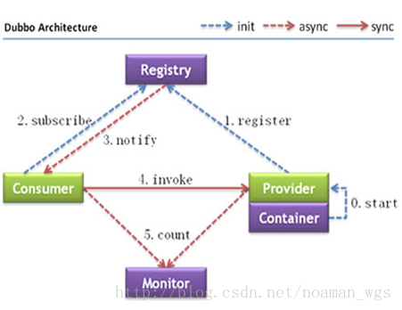

[TOC]

# java基础

## java语言相关

### 类的实例化顺序

> 1. 赋值父类静态变量和执行静态代码块
> 2. 赋值子类静态变量和执行静态代码块
> 3. 执行父类构造代码块和构造方法
> 4. 执行子类构造代码块和构造方法

### 面向对象特性

### 多态

### 抽象类和接口


## 集合框架

### 常用集合框架有哪些?

> 集合框架有两大接口:Collection  和 Map 
> Collection下有 List可重复集合 和Set不可重复集合
> List的实现有:数组结构的ArrayList,Vector和Stack,链表结构的LinkedList
> Set的实现有:HashSet,LinkedHashSet,TreeSet
> Map的实现有:HashMap,LinkedHashMap,TreeMap,Hashtable


### ArrayList 的实现原理

> ArrayList 是数组实现的.它有一个重要的成员变量 Object[] elementData;
> 插入元素的时候,找到索引所在的位置插入相应的元素,并把当前位置后的元素依次向后移动一位.
> 查询的时候可以直接根据索引获取到对应的元素.
>
> ArrayList 初始容量为10, oldCapacity + (oldCapacity >> 1) 大概1.5倍增长
>
> transient Object[] 是实际存放数据的地方,transient 是为了节省内存做的优化, 
> ArrayList 中自定义了序列化的规则,  
> 只对Object[] 中实际存在的对象进行序列化,而不是整个数组,这样节省了内存.


### Vector的实现原理

> Vector 与ArrayList 的实现原理一样,都是使用数组来保存数据,
> 不同的是Vector的增删改查操作都是线程同步的。使用了synchronized关键字
> 保证了线程同步.


### LinkedList 的实现原理

> LinkedList 是基于双向链表实现的, 它有一个内部类 Node实现了双向的链表的数据结构,Node 中包含了上一个节点和下一个节点的引用
> java8 中LinkedList 有这三个成员变量:Node first ；Node last ；int size ；
>
> 假如size为10,现在需要在索引为3的位置插入一个元素,则从 first 开始,递归向后查找到第四个元素后,
> 在这个Node前面插入新 Node,  
> 然后维护好这两个Node的指针.如果是在索引为8的位置插入 则从last开始,由后向前进行.
>
> 查询index为3的元素时,从first开始,由第一个节点向后查询到第四个元素返回.


### HashMap 的实现原理

> HashMap 是数组和链表的结合体，本质上是一个数组，数组中保存的是具有链表数据结构的Entry。
> HashMap 的一些私有变量：int capacity；float loadFactor; Entry[] table;int size;int threshold;
>
> put操作的实现：HashMap 的 hash 方法会根据 key 的 hashCode 生成一个索引，如果 table 数组在该位置没有元素，就 new 一个 Entry 保存在该位置，如果已经存在元素且两者的 key 不相等，就将新元素保存在链表头部，如果已经存在元素且两者的 key 相等，就将新元素覆盖旧元素。在JDK8中，当链表长度达到8，会转化成红黑树
>
> 读取的实现：hash 方法会根据 key 的 hashCode 生成一个索引，再取出table数组中的索引处的Entry，然后返回该key对应的value。
>
> HashMap 的扩容：capacity是数组的长度，默认是大小为16，loadFactor 是装载因子，默认0.75，当元素个数，size表示HashMap中存放KV的数量 。threshold 是扩容临界值。当size > threshold 时会进行扩容。扩容会创建一个原来2倍大小的新数组，然后将原哈希表中的所有数据移动到新的哈希表中，相当于对原哈希表中所有的数据重新做了一个put操作。所以性能消耗很大
>
> 链的产生：新的Entry对象添加到 table 中时，新添加的 Entry 对象将持有对原有 Entry 对象的引用，形成Entry链。
>
> Hash 冲突：当试图将两个key的hashCode相同时，会产生hash冲突，hashMap是通过链表的形式解决hash冲突。后添加的 Entry 对象将持有对原有 Entry 对象的引用，形成Entry链。这是哈希算法中解决冲突的一种方法,叫链地址法


### **LinkedHashMap 的实现原理**

>LinkedHashMap 是HashMap的子类，拥有HashMap的所有特性。并自己维护了一个双向链表。类里有两个成员变量 Entry head ;Entry  tail, 分别指向双向链表的表头、表尾。  accessOrder 默认 false ,表示 基于插入顺序 
>
>put 操作: LinkedHashMap并没有重写任何put方法。但是其重写了构建新节点的newNode()方法. 在每次构建新节点时，将新节点链接在内部双向链表的尾部。
>
>get操作：LinkedHashMap的get()方法会改变数据链表，LinkedHashMap具有可预知的迭代顺序：插入顺序、访问顺序。默认是插入顺序排序，如果指定按访问顺序排序，那么调用get方法后会将这次访问的元素放到链表的尾部，不断访问可以形成按访问顺序形成的列表.

```java
Map<String, String> map = new LinkedHashMap<String, String>(16, 0.75f, true);  
for (int i = 0; i < 10; i++) {  
    map.put("key" + i, "value" + i);  
}
map.get("key" + 3);  
for (String value : map.keySet()) {  
    System.out.println(value); // key3:value3 被放在了最后
}
```

### **TreeMap 的实现原理**

> TreeMap 初始化的时候会初始化下列参数，第一个Comparator是可以自己定义实现的一个比较的实现，默认为Null,那么默认的比较方式就是compare方法。Entry root;默认为Null。其中Entry内部维护了left,right,parent,color  其中color默认是black。https://www.cnblogs.com/daoluanxiaozi/p/3340382.html
>


### HashSet 的实现原理

>HashSet 聚合了 一个HashMap ，使用HashMap的key来保存数据， 它所有的方法都是调用HashMap对应的方法来实现的


### Arrays.sort 和 Collections.sort怎么实现的？

> Arrays.sort对于基本数据类型使用的是快速排序，对 对象使用的是归并排序 ，两者的时间复杂度都是n*logn,但合并排序需要额外的n个空间 

LinkedHashMap的应用场景

hashtable和hashmap的区别及实现原理

hashmap会问到数组索引

hash碰撞怎么解决

arraylist和linkedlist区别及实现原理

TreeMap的实现原理

concurrenthashmap具体实现及其原理，jdk8下的改版

如果让你实现一个并发安全的链表，你会怎么做

简述ConcurrentLinkedQueue和LinkedBlockingQueue的用处和不同之处

## 动态代理

动态代理的几种方式

反射的原理，反射创建类实例的三种方式是什么？

反射中，Class.forName和ClassLoader区别

## 反射

## 泛型

## IO/NIO

## 序列化

### UID的作用

反序列化时的UID必须与序列化前的UID相同,否则会序列化失败

### java默认的序列化的缺点

只支持java语言, 性能比较低 

### 其他序列化方案

json, xml, kryo, protocol buf, hesson, thrift, messagepack

### 序列化的应用

深拷贝对象

```java
public Student testClone()  throws Exception{
    ByteArrayOutputStream outputStream = new ByteArrayOutputStream();
    ObjectOutputStream outputStream2 = new ObjectOutputStream(outputStream);
    outputStream2.writeObject(this);
    ByteArrayInputStream inputStream = new ByteArrayInputStream(outputStream.toByteArray());
    ObjectInputStream inputStream2 = new ObjectInputStream(inputStream);
    Object object = inputStream2.readObject();
    return (Student) object;
}
```


## 多线程

### 线程状态？

> java中有一个枚举类描述的线程状态，一共6个：new,runable,blocked,timed_waiting,waiting,terminated
>
> 一般认为线程有5个状态，首先是新建状态，调用这个线程的start方法后线程进入就绪状态，CPU调度到这个线程后进入运行状态，遇到IO、网络连接、或者调用sleep、wait 时会进入阻塞状态，需要重新等待CPU的调度，最后是终止状态。（我们认为IO、网络连接不消耗CPU ）

### 同步方法与同步块的区别

> 执行同步方法需要获得当前实例的监视器，执行同步代码块需要获取指定实例的监视器
>
> 同步的实例方法执行时需要获取类对象的监视器，类似于在同步代码块中使用this作为同步对象，这种情况下， 一个实例的某个非静态同步方法不能同时在两个线程中运行，
> 如果这个实例有两个非静态同步方法 a()和 b(),这两个方法也不能同时在两个线程中运行。
> 静态同步方法锁定的是实例的类对象，同一个对象的多个实例,他们的静态同步方法不能在两个线程中同时运行。
> 对于锁定相同对象的方法/代码块不能同时运行在多个线程中。

### 如何让多个线程按顺序执行

> 通过join方法来实现，主线程中启动了一个子线程，主线程调用子线程的join方法后，子线程完成后主线程才继续执行。也可 以通过线程数为1的线程池来实现.

```java
ExectorService excutor =  Excutors.newSingleThreadExcutor();
excutor.execte(thread1);
excutor.execte(thread2);
excutor.shuntdow();
```

### volatile, synchronized, Lock

> java内存分为工作内存和主存，工作内存是线程私有的，当一个线程对volatile变量的进行修改时，会立即从工作内存刷新到主存，并且其他线程对volatile变量的读会读主存中的值。主内存主要包括本地方法区和堆，工作内存主要包括栈、本地方法栈和程序计数器
>
> 当一个线程执行 某个对象的 synchronized 方法的时候，会先获取这个对象的监视器 Monitor，之后才能执行这个方法，如果获取不到监视器，则会阻塞并进入到一个同步队列等待获取监视器，其他线程释放这个监视器时会通知这个队列。当线程在synchronized 方法中又执行了这个对象的其他的synchronized  方法，则这个线程需要重新获取监视器，这个时候不会阻塞而是对Monitor的计数器加1。
>
> Lock是一个接口，它有3个实现类，ReentrantLock，ReadLock，WriteLock，其中后两个是ReentrantReadWriteLock的内部类，Lock 实例以及 Condition 实例可以用来阻塞、唤醒线程，达到控制线程的目的。

### 线程间如何通信

> 1. volatile 共享内存 
> 2. wait/notify 消息传递 

### 完成线程同步的方式

> 1. 使用带有synchronized关键字的同步方法或者同步代码块
> 2. 使用 java.util.concurrent.lock Lock对象。

### 什么是死锁

> 两个线程都在等待对方释放锁之后才能继续往下执行，就发生了死锁, 一般发生在两段同步代码块中


线程池的种类、区别和使用场景

分析线程池的实现原理和线程的调度过程

线程池如何调优

线程池的最大线程数目根据什么确定

volatile的语义，它修饰的变量一定线程安全吗

ThreadLocal用过么，原理是什么，用的时候要注意什么

Synchronized和Lock的区别

synchronized 的原理，什么是自旋锁，偏向锁，轻量级锁，什么叫可重入锁，什么叫公平锁和非公平锁

用过哪些原子类，他们的参数以及原理是什么

cas是什么，他会产生什么问题（ABA问题的解决，如加入修改次数、版本号）

简述AQS的实现原理

countdowlatch 和 cyclicbarrier的用法，以及相互之间的差别?

concurrent包中使用过哪些类？分别说说使用在什么场景？为什么要使用？

LockSupport工具

Condition 接口及其实现原理

Fork/Join框架的理解

jdk8的 parallelStream 的理解

分段锁的原理,锁力度减小的思考

## 常用类及方法

### String, StringBuilder,  StringBuffer

> 三者都是使用char[] 的数组保存数据的 ,都是CharSequence 接口的实现类
>
> String中的 concat, replace 等方法不对char[]数组进行操作, 它最终返回一个新的String对象, 所以原String对象一但创建好后它的值将不会改变(因为没有改变的入口)
>
> StringBuilder 的append,delete等方法是对当前对象进行操作 并返回当前对象
>
> StringBuffer 的append 等方法都有 synchronized 关键字修饰

### final,finally,finalize

> final修饰类，表示类不能被继承,修饰方法,表示方法不能被重写,修饰成员变量,表示基本数据类型的变量是不可改变或者引用类型的引用不可改变,引用对象中的内容可以改变
>
> finally 是 try catch代码块的组成部分, 不管有没有异常发生finally 语句块都将被执行.
>
> finalize 是Object中的一个方法, 这个方法一般在GC线程中被调用,一般用来做关闭连接、关闭文件等释放资源的操作

### throw,throws,throwable

> throw 用在方法体内,表示抛出异常
>
> throws 用在方法声明后面,表示再抛出异常,由调用这个方法的上一级方法中的语句来处理,出现异常的一种可能性
>
> Throwable 是 Java 语言中所有错误或异常的超类

### sleep,wait 

cloneable接口实现原理，浅拷贝or深拷贝

> Object a=new Object();Object b;b=a;这种形式的代码复制的是引用,
> a和b对象仍然指向了同一个对象
> 浅拷贝


quartz 和 timer对比

## JVM

### 虚拟机启动参数

> 1. 准参数（-）, 所有 JVM 都必须实现这些参数的功能，而且向后兼容；
>
>    -D<key>=<value> 设置系统属性,代码中可以通过 System.getProperty("key"); 获取该属性
>
> 2. 扩展参数（-X）, 不保证所有jvm实现都满足，且不保证向后兼容；
>
> 3. 不稳定参数（-XX）, 将来可能会随时取消，需要慎重使用；

### 不稳定参数语法规则

>  -XX:+<option>  表示启用该选项
>
>  -XX:-<option>  表示关闭该选项
>
>  -XX:<option>=<value> 给选项设置一个值

### 怎么查看GC日志?

在JVM启动时 指定参数 `-XX:+PrintGCDetails -Xloggc:./gc.log -XX:+PrintGCDateStamps  `

```
2018-04-13T21:59:38.595+0800: 22.258: GC (Allocation Failure) [PSYoungGen: 214013K->33789K(186368K)] 353197K->253557K(407552K), 0.0560998 secs 
2018-04-13T21:59:38.651+0800: 22.315: Full GC (Ergonomics) [PSYoungGen: 33789K->33765K(186368K)] [ParOldGen: 219768K->219156K(401920K)] 253557K-252921K(588288K), [Metaspace: 2836K->2836K(1056768K)], 2.4230938 secs 
2018-04-13T21:59:44.922+0800: 28.585: GC (Allocation Failure) [PSYoungGen: 186341K->51116K(266752K)] 405497K->301024K(668672K), 0.0650235 secs 
```
### Java 有哪些引用类型

```
强引用, 软引用, 弱引用, 虚引用
```


```
native方法是非Java语言实现的代码
```

常用的GC算法有哪些

JVM内存分代

Java内存模型，以及其在并发中的应用

Java 8的内存分代改进

JVM垃圾回收机制，何时触发MinorGC等操作

答死循环，不断创建对象

jvm中一次完整的GC流程（从ygc到fgc）是怎样的，重点讲讲对象如何晋升到老年代

JVM常用参数

你知道哪几种垃圾收集器，各自的优缺点，重点讲下cms，g1

新生代和老生代的内存回收策略

Eden和Survivor的比例分配等

深入分析了Classloader，双亲委派机制

JVM的编译优化

指令重排序，内存栅栏等

OOM错误，stackoverflow错误，permgen space错误

g1和cms区别,吞吐量优先和响应优先的垃圾收集器选择

说一下强引用、软引用、弱引用、虚引用以及他们之间和gc的关系

## JDBC

### 什么是JDBC

> java database connection ,java 数据库连接技术, 是一组接口标准,它访问各种不同关系数据库的公共API，.主要包括 一个类: DriverManager; 四个接口: Connection, Statement, ResultSet, PreparedStatement

### 实现JDBC的技术有哪些

> 1. JDBC-ODBC桥接技术
>
>    ODBC指的是开放数据库连接, 是由微软提供的数据库连接应用,利用JDBC 操作ODBC 从而实现数据库的连接, 性能较差. 支持的JDBC版本是最新的.
>
> 2. JDBC直接连接
>
>    由不同的数据库生产商提供指定的数据库连接驱动程序, 性能是最好的, 一般支持的JDBC版本不是最新的.
>
> 3. JDBC网络连接
>
>    使用专门的数据库网络连接命令进行指定主机的数据库操作,此种方式使用最多. 
>
> 4. 模拟指定数据库的通讯协议自己编写数据库操作

### JDBC连接数据库的流程

> 1. 加载数据库的驱动程序, 数据库的生产厂商提供数据库驱动程序来适配 JDBC
>
> 2. 进行数据库的连接, 连接地址,用户名,密码
>
>    要连接数据库必须要靠 DriverManager 类完成, 它接收用户名密码, 返回一个Connection 
>
> 3. 进行数据库的 操作
>
> 4. 关闭数据库

### JDBC体现的设计模式

JDBC操作在取得数据库连接对象时, 采用的是工厂设计模式, DriverManager 是工厂类, Connection 是产品接口, 对于mysql 得到的是 com.mysql.jdbc.JDBC4Connection 实现类 


reader.readLine() 和 inputStream.read(), outputStream.flush() 的坑 

> reader.readLine() 在遇到换行符之前会一直读 , 这就会发生阻塞,  直到遇到换行符的时候才会返回读取结果 ,且 换行符并不返回, 
>
> inputStream.read() 方法执行时如果遇到文件末尾会返回-1,而socket通信时，服务端会一直等待客户端输入. 
>
> 解决办法:  在最后一次读取时由于流里所剩的字节数小于b的长度，流就认为到了流的末尾。如果为整数的话阻塞原因同上。
>
> outputStream.flush()  的作用是清空缓冲区, 并不保证网络传输.  

# framework

## spring

### EL表达式

\#{} 支持字面量赋值, 数学运算, 


### 事务管理

jdbc的事务管理过程是 获取连接, 开启事务, 业务完成提交事务, 业务失败回滚事务. 

spring的事务管理有两种实现方式,一种是编程式事务,另一种是声明式事务, 编程式事务是指将事务的管理代码嵌入到业务代码中来控制事务的提交和回滚. 另一种是声明式事务.  可以通过AOP的方式来实现声明式事务管理. 

### 事务的传播行为

当在一个事务方法调用另外一个事务方法时.事务怎么传播.

Spring的事务方法不能调用同一个类里面的另外一个事务方法，必须调用外面的类去做事物操作.

在一个Service内部，事务方法之间的嵌套调用，普通方法和事务方法之间的嵌套调用，都不会开启新的事务.是因为spring采用动态代理机制来实现事务控制，而动态代理最终都是要调用原始对象的，而原始对象在去调用方法时，是不会再触发代理了！

### 事务的隔离级别

常用的事务隔离级别是读已提交

### AOP与IOC的实现原理

### BeanFactory和FactoryBean


### CGlib

### RMI与代理模式

### 事务隔离级别

### 非单例注、循环注入

### controller是单例还是多例，怎么保证并发的安全


## spring mvc

### MVC框架原理，他们都是怎么做url路由的

## spring boot

### spring boot特性，优势，适用场景等

## mybatis

### Mybatis的底层实现原理

## netty

# 各种协议、思想、规范

##设计模式

### 工厂模式

1. 创建接口 `Shape `
2. 创建两个以上的具体类,分别实现 `Shape` 接口
3. 创建一个`ShapeFactory `工厂类, 编写一个`public Shape getShape(String shapeType){}` 方法, 根据不同的入参返回不同的`Shape`
4. 使用:`new ShapeFactory().getShape("CIRCLE") `

### 抽象工厂模式

1. 创建第一个接口`Shape`
2. 创建两个以上的具体类,分别实现 `Shape` 接口
3. 创建第二个接口`Color`
4. 创建两个以上的具体类,分别实现 `Shape` 接口
5. 创建`AbstractFactory.java`,声明两个抽象方法,分别返回`Shape`和`Color`
6. 创建工厂类`ShapeFactory`,继承` AbstractFactory`,根据不同的入参返回不同的Shape
7. 创建工厂类`ColorFactory `,继承` AbstractFactory`,根据不同的入参返回不同的Color
8. 创建超级工厂`FactoryProducer `,静态方法根据不同的入参返回不同的工厂
9. 使用:`FactoryProducer.getFactory("COLOR").getColor("RED")`

### 单例模式

1. 创建一个`SingleObject `类,并在类中定义一个静态私有字段

   `private static SingleObject instance = new SingleObject()`,

   然后定义私有构造函数,

   再定义静态的`getInstance()`方法,返回instance 

2. 使用:`SingleObject.getInstance()`

### 原型模式

### 模板模式

# 数据

## 排序问题

### 归并排序

### 快速排序

### 希尔排序

## 数据结构

什么是数据结构？

> 数据元素以及元素之间关系的集合

### 遍历一个二叉树?

```java
import java.util.ArrayList;

public class App {
	private ArrayList<Node> list = new ArrayList<Node>();

	public static void main(String[] args) {
		new App();
	}
	
	public App() {
		Node root = new Node("root");
		Node node2 = new Node("node2");
		Node node3 = new Node("node3");
		Node node4 = new Node("node4");
		Node node5 = new Node("node5");
		Node node6 = new Node("node6");
		Node node7 = new Node("node7");
		root.left = node2;
		node2.right = node3;
		root.right = node4;
		node4.left = node5;
		node4.right = node6;
		node5.right = node7;

		recursive(root);
		for (Node node : list) {
			System.out.println(node.name);
		}
	}

	private void recursive(Node node) {
		if(node!=null) {
			recursive(node.left);
			this.list.add(node);
			recursive(node.right);
		}
	}

	class Node {
		String name;
		Node left;
		Node right;
		public Node(String name) {
			this.name = name;
		}
	}
}
```


树 

二叉树：满二叉树、完全二叉树、最优二叉树(赫夫曼树  )

线性表

线性链表

栈

队列

串

数组

广义表


前序遍历、中序遍历、后续遍历

## redis

## mysql

## oracle

## 数据库集群

### 分库分表？

先考虑业务拆分和硬件升级, 增加数据库节点和负载均衡进行读写分离，


# 中间件

> ObjectWeb defines middleware as: "The software layer that lies between the operating system and applications on each side of a distributed computing system in a network."[4] Services that can be regarded as middleware include enterprise application integration, data integration, message oriented middleware (MOM), object request brokers (ORBs), and the enterprise service bus (ESB).
>
> ObjectWeb将中间件定义为：“位于网络中分布式计算系统两侧的操作系统和应用程序之间的软件层。” 可被视为中间件的服务包括企业应用程序集成，数据集成，面向消息的中间件（MOM），对象请求代理（ORB）和企业服务总线（ESB）。
>
> from [wikipedia](https://en.wikipedia.org/wiki/Middleware)

## tomcat

## nginx

### 安装步骤

> 1. 安装gcc和库文件:
>
> ```
> yum -y install make zlib zlib-devel gcc-c++ libtool  openssl openssl-devel
> ```
>
> 2. 编译安装pcre：
>
> ```bash
> cd /usr/local/
> wget http://downloads.sourceforge.net/project/pcre/pcre/8.35/pcre-8.35.tar.g
> tar zxvf pcre-8.35.tar.gz
> cd pcre-8.35
> ./configure
> make && make install
> ```
>
> 3. 编译安装Nginx
> ```bash
> cd /usr/local/
> wget http://nginx.org/download/nginx-1.8.1.tar.gz
> tar zxvf nginx-1.8.1.tar.gz
> cd nginx-1.8.1
> ./configure \
> --prefix=/usr/local/webserver/nginx \
> --with-http_stub_status_module --with-http_ssl_module \
> --with-pcre=/usr/local/src/pcre-8.35
> make && make install
> /usr/local/webserver/nginx/sbin/nginx -v
> ```
> 4. 创建 www 用户组
> ```bash
> groupadd www
> useradd -g www www
> ```
> 5. 修改 nginx.conf
> ```properties
> user  www;
> http { 
>     upstream  myserver #配置集群
>     {
>         server  127.0.0.1:18080  weight=1;
>         server  127.0.0.1:28080  weight=2;
>     }
>     server {
>         listen       8888;
>         server_name demo.com  #监听HOST为demo.com的请求
>         location / { 
>             proxy_pass http://myserver;  #myserver
>         }
>     }
> }
> ```
>

### 管理命令

```bash
./nginx				#启动
./nginx -s reload	#重载配置
./nginx -s reopen	#重启
./nginx -s stop 	#停止
```

### 配置文件-路径匹配？

```bash
~ 	     #为区分大小写匹配
~*	     #为不区分大小写匹配
!~	     #分别为区分大小写不匹配
!~*	     #不区分大小写不匹配
-f       #判断是否存在文件 
-d       #判断是否存在目录
-e       #判断是否存在文件或目录 
-x       #判断文件是否可执行
!-x      #判断文件是否可执行
```

### 配置文件-nginx指令？

nginx.conf  中用到了一些指令，这些指令如下

- root

```properties
location ~ .(mp3|mp4) {
	root /www/media;
}
# /test/123.mp3 -->  /www/media/123.mp3  指定目录作为根目录/www/media/进行检索
```

- alias

```properties
location /test/   
{   
    alias/first/second/img/;
}
# /test/1.jpg  -->  /first/second/img/1.jpg 将字符串/test/替换为/first/second/img/
```

- proxy_pass

```properties
location /test/   
{
    proxy_pass http://127.0.0.1:8080/;   
}
# /test/1.jpg  -->  http://127.0.0.1:8080/1.jpg（转发，不附加/test/路径）
```

```properties
location /test/   
{   
    proxy_pass http://127.0.0.1:8080;
} 
# /test/1.jpg  -->  http://127.0.0.1:8080/test/1.jpg (转发，附加/test/路径)
```

```properties
location/test/   
{   
    proxy_pass http://127.0.0.1:8080/img;
}  
# /test/1.jpg -->  http://127.0.0.1:8080/img1.jpg（未附加/test/路径，但附加了/test/之后的路径
```

## docker

### docker 基本命令

| 问题                    | 命令                                       |
| --------------------- | ---------------------------------------- |
| 添加国内镜像                | `vi /etc/systemd/system/multi-user.target.wants/docker.service` </br> `ExecStart=/usr/bin/dockerd --registry-mirror=https://jxus37ad.mirror.aliyuncs.com` `sudo systemctl daemon-reload` </br> `sudo systemctl restart docker` |
| 列出镜像                  | `docker images`                          |
| 搜索镜像                  | `docker search tomcat`                   |
| 下载镜像                  | `docker pull tomcat`                     |
| 搜索镜像                  | `docker search mongodb`                  |
| 下载镜像                  | `docker pull mongodb`                    |
| 创建并启动容器               | `docker run --name test-tomcat -p 80:8080 tomcat &` |
| 创建并启动容器               | `docker run --name test-tomcat2 -p 81:8080 tomcat &` |
| 创建并启动一个test-tomcat3容器 | `docker run --name test-tomcat3 -p 82:8080 tomcat &` |
| 停止容器                  | `docker stop test-tomcat`                |
| 启动容器                  | `docker start test-tomcat`               |
| 进入容器                  | `docker exec -it test-tomcat  /bin/sh`  ` cat logs/catalina.*.log` |
| 直接查看容器日志              | `docker logs test-tomcat`                |
| 退出容器                  | `exit`                                   |
| 查看当前所有容器              | `docker ps -a`                           |
| 删除容器                  | ` docker rm test-tomcat`                 |
| 删除所有容器                | `docker rm $(docker ps -aq)`             |
| 删除镜像                  | `docker rmi tomcat`                      |
| 删除所有镜像                | `docker rmi $(docker images -aq)`        |

### docker helloworld

+ `docker pull node`
+ `cat server.js`
```
var http = require('http');
http.createServer(function (request, response) {
    response.writeHead(200, {'Content-Type': 'text/plain'});
    response.end('Hello World\n');
}).listen(8888);
console.log('Server running at http://127.0.0.1:8888/');
```
+ `cat Dockerfile`
```
FROM node
RUN mkdir -p /usr/app
WORKDIR /usr/app
ADD . /usr/app
EXPOSE 8888
CMD [ "node", "server.js" ]
```
+ `docker build -t web-demo`
+ `docker run --name web-demo -p 8888:8888 web-demo &`
+ `curl localhost:8888`
```
Hello World
```
# 分布式

## 基础篇

### 什么是 RPC，RMI ，JMS

> RPC 指的是远程过程调用协议，使用的是Client/Server 模型，请求时需要通过程序号、版本号、过称号等确定一个服务
>
> RMI 指的是用 Java 语言开发的进行远程方法调用的一组API，能够让一个虚拟机上的对象调用另一个虚拟机对象上的方法
>
> JMS 指的是Java面向消息中间件(MOM)的技术规范，提供标准的产生、发送、接收消息的接口，类似于JDBC

### 什么是 SOAP 

> SOAP 叫做简单对象访问协议, 他是一种协议规范，使用XML作为消息格式，并依赖HTTP或者SMTP协议进行传输。

### 什么是 webservice

> webservice 是一套提供给 服务方和调用方的通信标准，是两个应用程序之间实现通信的解决方案，可以用HTTP POST/GET 代替这种方案
>
> 1. 使用WSDL（XML）描述服务方接口
> 2. 使用XML 传输请求、响应报文
> 3. 使用 SOAP 协议进行网络通信 
>
> 因为XML与编程语言无关，所以很容易做到了跨平台/系统调用。


### 如何实现一个RMI程序

>创建远程接口， 并且继承java.rmi.Remote接口 
>
>实现远程接口，并且继承：java.rmi.server.UnicastRemoteObject 类 
>
>创建服务器程序：通过 InitialContext 类的bind方法注册服务并监听端口 
>
>客户端程序直接用 javax.naming.InitialContext 的实例根据服务名 ”rmi://主机名:端口号/实例名“ 获取对象

### 集群怎么共享session

> mysql/redis： 采用mysql 或 redis 保存session 信息，用户登录的时候会尝试从数据库中获取session ，使用mysql 中性能不是很好，一般使用redis，并且redis也可以做集群
>
> cookie：服务端生产access_token(userid/name/timestamp) 保存在客户端cookie中，接到请求时服务端先看自己有没有这个session，没有的话就使用客户端上送的session，这种方式安全性不高
>
> session同步：服务器之间同步session，由一台服务器生产session，通过脚本或者其他方式同步到其他服务器上，这方案速度慢，同步session有延迟性什么是webservice

### 对分布式事务的理解

简单点说，分布式事务就是多应用跨数据库的事务,

数据库的两段提交或者MQ消息

## zookeeper

### 什么是 zookeeper

> zookeeper是使用树形结构保存数据的一个服务，可以单机部署，也可以做集群,集群中有一个leader,多个follower,每个server保存一份数据部分,所有server数据一致,分布式读写,数据保存在内存中，节点znode是保存数据的基本单元，节点可以有子节点。zookeeper也会定时持久化内存中的数据。zookeeper与客户端以TCP长连接保持会话，客户端可以在zookeeper上监听一些节点事件，事件触发时，zookeeper会通知客户端。

### 单机部署

> 单机安装比较简单直接下载zookeeper 解压后，配置下的数据文件目录，日志文件目录和超时时间设置，之后运行zookeeper 启动，OK

### 集群部署

> zookeeper集群包含3中角色，leader，follower，observer, 单机部署成功后，关闭服务，修改配置文件，在配置文件中以 server.${myid} 作为key  配置服务集群的IP:服务端口:选举端口[:observer],  之后创建myid文件，然后启动验证，其他服务做相同的操作，myid一般从1开始按服务器顺序递增。如果某台服务器是observer，还需要增加一行 peerType=observer 的配置

### 默认端口

> 对客户端提供服务：2181；集群间通信：2888；选举leader：3888

### observer 的作用

> zookeeper的数据变更需要半数以上服务器投票通过，在增加集群节点的时候会带来写性能上的下降，observer 不参与数据写入时的投票，因此在增加服务器节点的时候能带来读性能上的提升

### zookeeper的数据模型

> zookeeper的数据模型和文件系统类似，是一种树形的结构，每个节点称为znode，它是zookeeper中最基本的数据单元，节点可以保存数据和挂载子节点，这些节点的数据保存在内存中，zookeeper会定时把内存中的数据写入到磁盘中。节点分为持久化节点和临时节点，临时节点与客户端会话保持一致，会话失效节点会被清除。

### zooKeeper集群间通信

> Leader服务器会和每一个Follower建立TCP连接，默认2888端口，同时为每个Follower都创建一个叫做LearnerHandler的实体。LearnerHandler主要负责Leader和Follower之间的网络通讯，包括数据同步，请求转发和提议的投票等。Leader服务器保存了所有Follower的LearnerHandler。

### zooKeeper宕机

> 客户端会定时向服务器发送心态报文，zookeeper收到心跳报文后重置超时时间，在session未过期的情况下，客户端可以主动在地址列表里选择新的地址进行连接 

### zookeeper watcher机制 

> Znode 节点创建，节点删除，节点改变，子节点改变等事件，客户端可以对不同的节点的不同事件进行注册监听，这个监听是一次性的，事件触发后，zookeeper会通过TCP长连接通知客户端。

### zookeeper的用途

配置集中管理, 服务名称解析(根据服务名找到对方IP，类似DNS)， 分布式锁

### 选举的原理

### 分布式锁

> 1. 利用节点的唯一性来实现共享锁
>
> ZooKeeper 同一个目录下只能有一个唯一的文件名，两个客户端在相同目录下创建相同的znode，只能有一个成功。可以利用这个特性实现对资源的加锁，解锁时将创建的节点删除。其他监听该节点的客户端会收到通知来竞争这个锁
>
> 2. 利用临时的顺序实现共享锁
>
>   当多个客户端同时访问一个持久节点的时候，如果需要对资源加锁，需要告知zookeeper在当前节点下创建一个临时顺序节点，然后立即获取所有子节点，找到节点序号最小的节点，判断这个节点是不是自己创建的，如果是则代表获取到了锁，客户端完成对资源进行操作后删除该节点。

## dubbo

### dubbo 注册与发现过程



> 1. 服务提供者在启动时，向注册中心注册自己的服务。 
> 2. 消费者在启动时，向注册中心订阅自己所需的服务。 
> 3. 注册中心返回服务提供者地址列表给消费者，如果有变更，注册中心将基于长连接推送变更数据给消费者。 
> 4. 消费者从提供者地址列表中，基于软负载均衡，选一台提供者进行调用，如果调用失败，再选另一台调用。 
> 5. 消费者和提供者，在内存中累计调用次数和调用时间，定时每分钟发送一次统计数据到监控中心。

### 注册中心宕机

>  如果是zookeeper集群，任意一台宕机后，dubbo将切换到另外一台，注册中心全部宕机后，消费者和服务提供者仍能通过本地缓存进行通信

### 服务提供者宕机

> 服务提供者无状态，任意一台宕机后不影响使用，服务提供者全部宕机后，消费者应用将无法使用，并无限重连等待服务提供者恢复,dubbo默认有重试机制和超时机制，调用服务不成功时会重试, 重试时请求路由到其他机器上

### 聊聊Dubbo

### 分布式系统怎么做服务治理

> dubbo的基本功能是完成远程服务的调用，除此之外dubbo还有服务治理的功能，包括：软负载均衡, 容错 ,监控与统计 ,容量评估 ,路由 ,黑白名单 ，权限控制 ，依赖管理等
>
> 参考 [[服务治理过程演进](http://javatar.iteye.com/blog/1345073)]

### Dubbo的协议支持

> dubbo支持的协议有：dubbo/hessian/http/RMI/WebService/thrift/mamcached/redis


## activeMQ

### 部署

> 下载activeMq安装包
>
> tar -zxvf **.tar.gz
>
> sh bin/activemq start 启动activeMQ服务

### 默认端口/通信协议

> activeMQ使用61616提供服务，管理控制台在 8161端口，通信支持TCP、UDP、HTTP

### JMS 提供了哪些接口

> 连接工厂（ConnectionFactory）是由管理员创建，并绑定到 JNDI 树中。客户端使用 JNDI 查找连接工厂，然后利用连接工厂创建一个JMS连接。
>
> JMS连接（Connection）表示JMS客户端和服务器端之间的一个活动的连接，是由客户端通过调用连接工厂的方法建立的。
>
> JMS会话（Session）表示JMS客户与JMS服务器之间的会话状态。JMS会话建立在JMS连接上，表示客户与服务器之间的一个会话线程。
>
> JMS目的（Destination），又称为消息队列，是实际的消息源。
>
> JMS生产者和消费者。生产者（Message Producer）和消费者（Message Consumer）对象由Session对象创建，用于发送和接收消息。

### JMS的消息确认 

> JMS消息之后被确认后，才会认为是被成功消费。消息的消费包含三个阶段： 客户端接收消息、客户端处理消息、消息被确认 

### 点对点(p2p)

> 每个消息只能有一个消费者
>
> 消息的生产者和消费者之间没有时间上的相关性。无论消费者在生产者发送消息的时候是否处于运行状态，都可以提取消息

### 发布订阅(pub/sub) 
> 每个消息可以有多个消费者
>
> 消息的生产者和消费者之间存在时间上的相关性，订阅一个主题的消费者只能消费自它订阅之后发布的消息。JMS规范允许提供客户端创建持久订阅

### 消息组成

> 消息头:包含消息的识别信息和路由信息; 消息体; 属性

### 消息丢失问题

# 高并发

# bash