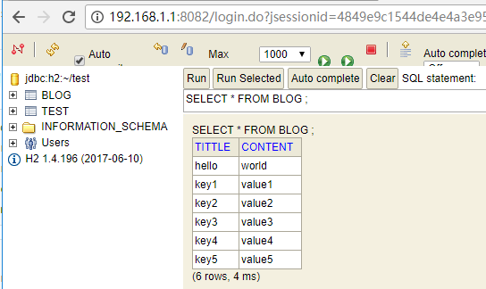

### 读取配置文件

pom.xml

```xml
<dependency>
  <groupId>org.mybatis</groupId>
  <artifactId>mybatis</artifactId>
  <version>3.4.1</version>
</dependency>
```

mybatis-config.xml

```xml 
<?xml version="1.0" encoding="UTF-8" ?>
<!DOCTYPE configuration PUBLIC "-//mybatis.org//DTD Config 3.0//EN" "http://mybatis.org/dtd/mybatis-3-config.dtd">
<configuration>
</configuration>
```
``` Java
@Test
public void loadResource() throws Exception{
	InputStream stream = ClassLoader.getSystemResourceAsStream("mybatis-config.xml");
	BufferedReader reader = new BufferedReader(new InputStreamReader(stream));
	while(true){
		String line=reader.readLine();
		if(line==null)break;
		System.out.println(line);
	}
}

@Test
public void loadResource1() throws Exception{
  InputStream stream =Resources.getResourceAsStream("mybatis-config.xml");
  BufferedReader reader = new BufferedReader(new InputStreamReader(stream));
  while(true){
    String line=reader.readLine();
    if(line==null)break;
    System.out.println(line);
  }
}
```
### 创建SqlSessionFactory

```xml
<configuration>
	<environments default="dev">
		<environment id="dev">
			<transactionManager type="JDBC" />
			<dataSource type="POOLED">
				<property name="driver" value="org.h2.Driver" />
				<property name="url" value="jdbc:h2:~/test" />
				<property name="username" value="sa" />
				<property name="password" value="" />
			</dataSource>
		</environment>
	</environments>
</configuration>
```

```java
@Test
public void createSqlSessionFactory() throws Exception{
	InputStream conf = ClassLoader.getSystemResourceAsStream("mybatis-config.xml");
	SqlSessionFactory factory = new SqlSessionFactoryBuilder().build(conf);
	SqlSession session = factory.openSession();
	System.out.println(session);
}
```
### 启动h2数据库

```xml 
<dependency>
	<groupId>com.h2database</groupId>
	<artifactId>h2</artifactId>
	<version>1.4.196</version>
</dependency>
```
```java
public static void main(String[] args) throws Exception {
	Server h2 = Server.createWebServer().start();
	System.out.println(h2.getURL());
}
```
创建表并插入数据




### 查询单条记录

```java
public class Blog {
	private String tittle;
	private String content;
	//getter,setter,toString 
}

public interface BlogMapper {
	Blog selectBlog(String tittle);
}
```

```xml
<?xml version="1.0" encoding="UTF-8" ?>
<!DOCTYPE mapper PUBLIC "-//mybatis.org//DTD Mapper 3.0//EN" "http://mybatis.org/dtd/mybatis-3-mapper.dtd">

<mapper namespace="test.BlogMapper">
	<select id="selectBlog" resultType="test.Blog">select * from blog where tittle=#{tittle}</select>
</mapper>
```


```java
public static void main(String[] args) throws Exception {
  Server h2 = Server.createWebServer().start();
  InputStream stream = ClassLoader.getSystemResourceAsStream("mybatis-config.xml");
  SqlSessionFactory sessionFactory = new SqlSessionFactoryBuilder().build(stream);
  SqlSession session = sessionFactory.openSession();
  Blog one = session.selectOne("test.BlogMapper.selectBlog","hello");
  System.out.println(one); //Blog [tittle=hello, content=world]
  h2.stop();
}
```
### 使用@Select代替Mapper.xml

```java
public interface BlogMapper {
	@Select("select * from blog where tittle = #{tittle}")
	Blog selectBlog(String tittle);
}
```

```xml
<mappers>
	<!-- <mapper resource="mapper/BlogMapper.xml"/> -->
	<package name="test"/>
</mappers>
```
```java
public static void main(String[] args) throws Exception {
	Server h2 = Server.createWebServer().start();
	InputStream stream = ClassLoader.getSystemResourceAsStream("mybatis-config.xml");
	SqlSessionFactory sessionFactory = new SqlSessionFactoryBuilder().build(stream);
	SqlSession session = sessionFactory.openSession();
	BlogMapper blogMapper = session.getMapper(BlogMapper.class);
	Blog blog = blogMapper.selectBlog("key1");
	System.out.println(blog); //Blog [tittle=key1, content=value1]
	h2.stop();
}
```

### #和$的区别

#

```java
public interface BookMapper {
	@Select("select * from book where bookname=#{bookname}")
	Book selectBlog(String bookname);
}
```

```java
public interface BlogMapper {
	@Select("select * from blog where tittle = #{tittle}")
	Blog selectBlog(Blog blog);
}
```

$

### 关联查询和嵌套查询

### 缓存使用场景

### 与Spring 集成

### 动态代理


