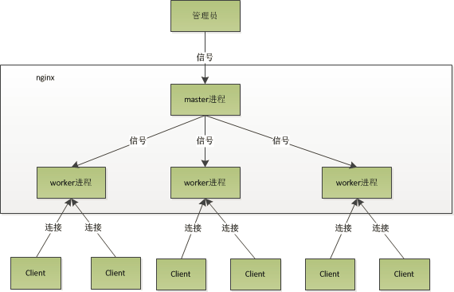

## Nginx 安装

### 安装 gcc 和库文件

```bash
yum -y install make zlib zlib-devel gcc-c++ libtool  openssl openssl-devel
```

### 安装 pcre

```bash
cd /usr/local/
wget http://downloads.sourceforge.net/project/pcre/pcre/8.35/pcre-8.35.tar.gz
tar zxvf pcre-8.35.tar.gz
cd pcre-8.35
./configure
make && make install
```

### 验证 pcre

```bash
pcre-config --version
```

### 下载 Nginx

> 到http://nginx.org/

```bash
cd /usr/local/
wget http://nginx.org/download/nginx-1.8.1.tar.gz
tar zxvf nginx-1.8.1.tar.gz
cd nginx-1.8.1
./configure \
--prefix=/usr/local/webserver/nginx \
--with-http_stub_status_module --with-http_ssl_module \
--with-pcre=/usr/local/src/pcre-8.35
make && make install
```

### 验证 Nginx

```bash
/usr/local/webserver/nginx/sbin/nginx -v
```

### 创建 www 用户组

```bash## 
groupadd www
useradd -g www www
```

### 修改 nginx.conf

```
user  www;
http { 
    upstream  myserver #配置集群
    {
        server  127.0.0.1:18080  weight=1;
        server  127.0.0.1:28080  weight=2;
    }
  
    server {
        listen       8888;
        server_name demo.com  #监听HOST为demo.com的请求
        location / { 
            proxy_pass http://myserver;
        }
    }
}
```

```
# 反向代理
server {
    listen 80;
    server_name your.domain.name;
    location / {
        # 把跟路径下的请求转发给前端工具链（如gulp）打开的开发服务器
        # 如果是产品环境，则使用root等指令配置为静态文件服务器
        proxy_pass http://localhost:5000/;
    }

    location /api/ {
        # 把 /api 路径下的请求转发给真正的后端服务器
        proxy_pass http://localhost:8080/service/;
        # 把host头传过去，后端服务程序将收到your.domain.name, 否则收到的是localhost:8080
        proxy_set_header Host $http_host;
        # 把cookie中的path部分从/api替换成/service
        proxy_cookie_path /api /service;
        # 把cookie的path部分从localhost:8080替换成your.domain.name
        proxy_cookie_domain localhost:8080 your.domain.name         
    }
}  
```


## Nginx WIKI

### 启动与停止

```
./nginx				#启动
./nginx -s reload	#重载配置
./nginx -s reopen	#重启
./nginx -s stop 	#停止
```

### 配置文件示例

>  Nginx 官网 [Wiki](https://www.nginx.com/resources/wiki/start/#pre-canned-configurations) 页面有很多配置文件的范例，用于不同的场景，比如负载均衡，反向代理，适配 Django 等

### 正则表达式匹配

```
~ 	为区分大小写匹配
~*	为不区分大小写匹配
!~	分别为区分大小写不匹配
!~*	不区分大小写不匹配
```

### 文件及目录匹配

```
-f和!-f	判断是否存在文件 
-d和!-d	判断是否存在目录
-e和!-e	判断是否存在文件或目录 
-x和!-x	判断文件是否可执行
```

### Nginx 指令

> nginx.conf  中用到了一些指令，这些指令如下

#### root 

root指令能指定那个目录作为根目录用于文件的检索，这个指令能用于http,server,location这些块中

```
location ~ .(mp3|mp4) {
	root /www/media;
}
```

请求/test/123.mp3，将会返回文件/www/media/123.mp3

#### alias 

```
location /test/   
{   
    alias/first/second/img/;
}
```

请求/test/1.jpg，将会返回文件/first/second/img/1.jpg 相当于将字符串`/test/`替换为`/first/second/img/`

#### proxy_pass 

```
location /test/   
{
    proxy_pass http://127.0.0.1:8080/;   
}
```

请求/test/1.jpg , 将会被nginx转发到 http://127.0.0.1:8080/1.jpg（未附加/test/路径）

```
location /test/   
{   
    proxy_pass http://127.0.0.1:8080;   
} 
```

请求/test/1.jpg，将会被nginx转发到http://127.0.0.1:8080/test/1.jpg（附加/test/路径）

```
location/test/   
{   
    proxy_pass http://127.0.0.1:8080/img;   
}  
```

请求/test/1.jpg ，将会被nginx转发到http://127.0.0.1:8080/img1.jpg（未附加/test/路径，但附加了/test/之后的路径

## Nginx QA

**Nginx 服务器上的 Master 和 Worker 进程分别是什么?**



nginx在启动后，会有一个master进程和多个worker进程。master进程主要用来管理worker进程，包含：接收来自外界的信号，向各worker进程发送信号，监控worker进程的运行状态，当worker进程退出后(异常情况下)，会自动重新启动新的worker进程。而基本的网络事件，则是放在worker进程中来处理了。多个worker进程之间是对等的，他们同等竞争来自客户端的请求，各进程互相之间是独立的。一个请求，只可能在一个worker进程中处理，一个worker进程，不可能处理其它进程的请求。worker进程的个数是可以设置的，一般我们会设置与机器cpu核数一致